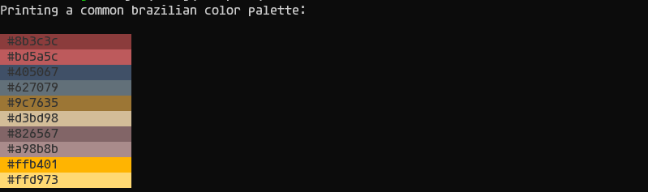

# AnsiStream

<p align="center">
  <a href="https://crates.io/crates/ansistream">
    
  </a>
  <a href="https://crates.io/crates/ansistream">
    
  </a>
  
  <a href="https://opensource.org/licenses/MIT">
    
  </a>
  <a href="https://github.com/jgardona/ansistream/actions/workflows/rust.yml">
    
  </a>
</p>

Write blazingly fast, free allocation ansi escape codes to a buffer, and flushes them all to any output stream. Supports 8/16 colors, 256 colors, RGB color rendering output.

## ANSI Escape Codes for Terminal Graphics
The ANSI escape code standard, formally adopted as ISO/IEC 6429, defines a series of control sequences.
Each control sequence begins with a **Control Sequence Introducer** (CSI), defined as a scape character
followed immediately by a bracket: **ESC[**. In particular, a CSI followed by a certain number of "parameter bytes"
(ASCII 0-9:; <=>?) then the letter m forms a control sequence known as **Select Graphic Rendition** (SGR). If no
parameter bytes are explicitly given, then it is assumed to be 0. SGR parameters can be chained together with a semicolon **;**
as **delimiter**.

Some common SGR parameters are shown below.

|Parameter | Effect|
|- | -|
|0 | reset all SGR effects to their default|
|1 | bold or increased intensity|
|2 | faint or decreased insensity|
|4 | singly underlined|
|5 | slow blink|
|30-37 | foreground color (3/4 bit)|
|38;5;x | foreground color (256 colors, non-standard)|
|38;2;r;g;b | foreground color (RGB, non-standard)|
|40-47 | background color (8 colors)|
|48;5;x | background color (256 colors, non-standard)|
|48;2;r;g;b | background color (RGB, non-standard)|
|90-97 | bright foreground color (non-standard)|
|100-107 | bright background color (non-standard)|


* Below example will print a red underlined text.


## Usage

* Add the **AnsiStream** crate to your Cargo.toml

```
$ cargo add ansistream
```

* Initialize a buffer and write a simple string in it

```rust
// initialize a ansi stream
let output = Cursor::new(Vec::<u8>::new());
let mut astream = ansistream::AnsiScapeStream::new(output);
// write a simple string in buffer
astream.write_string("the quick brown fox jumps over the lazy dog")?;
// data will be flushed when astream drop or gets flushed
```

* Write the stream in stdout

```rust
let stdout = io::stdout().lock();

let mut astream = ansistream::AnsiScapeStream::new(stdout);
astream.write_string("simple text")?;

astream.flush()?;
```

* Writing a green foreground text to stream

```rust
let mut astream = AnsiEscapeStream::new(writer);
astream.write_text_fc_fmt(FCGREEN, format_args!("123")).unwrap();
// asserts that fcgreen was writed and also reseted with fcdefault
assert_eq!(
    &[0x1b, 0x5b, 0x33, 0x32, 0x6d, 0x31, 0x32, 0x33, 0x1b, 0x5b, 0x33, 0x39, 0x6d],
    astream.buffer()
);
```

* Write formatted color output

```rust
let mut astream = AnsiEscapeStream::new(writer);

  for i in 100..=107 {
      astream.write_text_color_fmt(FC_LIGHT_GRAY, i, format_args!("{i:>5} "))?;
  }
```

## Examples

* 16color example


```
$ hyperfine --warmup 100 '16color'
Benchmark 1: 16color
  Time (mean ± σ):      10.9 ms ±   0.4 ms    [User: 5.7 ms, System: 9.3 ms]
  Range (min … max):    10.3 ms …  12.2 ms    133 runs
```

* 256color example


```
$ hyperfine --warmup 100 '256color'
Benchmark 1: 256color
  Time (mean ± σ):      11.3 ms ±   0.4 ms    [User: 4.9 ms, System: 9.3 ms]
  Range (min … max):    10.7 ms …  12.7 ms    130 runs
```

* truecolor example



```
$ hyperfine --warmup 100 'truecolor'
Benchmark 1: truecolor
  Time (mean ± σ):      11.2 ms ±   0.5 ms    [User: 5.4 ms, System: 9.2 ms]
  Range (min … max):    10.4 ms …  13.0 ms    131 runs
```
## Status

 ### Escape codes available

|Finnished | Type|
|- | -|
|x | Color and Style Escape Codes|
| | Screen and Cursor Escape Codes|

## References

### [Ansi Escape Codes](https://en.wikipedia.org/wiki/ANSI_escape_code)
