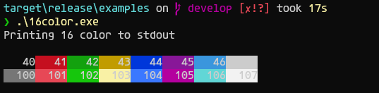
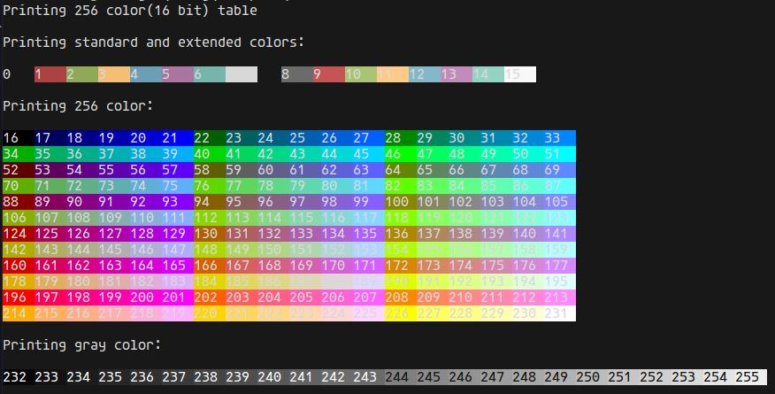

# Ansi Stream
Write blazingly fast, free allocation ansi escape codes to a buffer, and flushes them all to any output stream. Supports 8/16 colors, 256 colors, RGB color rendering output.

## ANSI Escape Codes for Terminal Graphics
The ANSI escape code standard, formally adopted as ISO/IEC 6429, defines a series of control sequences.
Each control sequence begins with a **Control Sequence Introducer** (CSI), defined as a scape character
followed immediately by a bracket: **ESC[**. In particular, a CSI followed by a certain number of "parameter bytes"
(ASCII 0-9:; <=>?) then the letter m forms a control sequence known as **Select Graphic Rendition** (SGR). If no
parameter bytes are explicitly given, then it is assumed to be 0. SGR parameters can be chained together with a semicolon **;**
as **delimiter**.

Some common SGR parameters are shown below.

|Parameter | Effect|
|- | -|
|0 | reset all SGR effects to their default|
|1 | bold or increased intensity|
|2 | faint or decreased insensity|
|4 | singly underlined|
|5 | slow blink|
|30-37 | foreground color (3/4 bit)|
|38;5;x | foreground color (256 colors, non-standard)|
|38;2;r;g;b | foreground color (RGB, non-standard)|
|40-47 | background color (8 colors)|
|48;5;x | background color (256 colors, non-standard)|
|48;2;r;g;b | background color (RGB, non-standard)|
|90-97 | bright foreground color (non-standard)|
|100-107 | bright background color (non-standard)|


* Below example will print a red underlined text.


## Usage

* Add the **AnsiStream** crate to your Cargo.toml

```
$ cargo add ansistream
```

* Initialize a buffer and write a simple string in it

```rust
// initialize an internal buffer with 30 bytes
let mut astream = ansistream::AnsiScapeStream::new(30);
// write a simple string in buffer
astream.write_string("the quick brown fox jumps over the lazy dog")?;
```

* Write the stream in stdout

```rust
fn flush<R: Read + Seek, W: Write>(reader: &mut R, writer: &mut) -> io::Result<()> {
    reader.seek(SeekFrom::Start(0))?;
    io::copy(reader, writer)?;
    reader.seek(SeekFrom::Start(0))?;

    Ok(())
}

let mut stdout = io::stdout().lock();

astream.write_string("simple text")?;
// AnsiScapeStream impl DerefMut
flush(&mut *astream, stdout)?;
```

* Writing a green foreground text to stream

```rust
let mut astream = AnsiEscapeStream::default();
astream.write_text_fc(FCGREEN, "123").unwrap();
// asserts that fcred was writed and also reseted with fcdefault
assert_eq!(
    &[0x1b, 0x5b, 0x33, 0x32, 0x6d, 0x31, 0x32, 0x33, 0x1b, 0x5b, 0x33, 0x39, 0x6d],
    astream.get_ref().as_slice()
);
```

## Examples

* 16color example



```
❯ hyperfine.exe --warmup 100 '.\16color.exe'
Benchmark 1: .\16color.exe
  Time (mean ± σ):      27.2 ms ±   1.0 ms    [User: 10.7 ms, System: 16.3 ms]
  Range (min … max):    26.1 ms …  31.9 ms    52 runs
```

* 256color example



```
❯ hyperfine.exe --warmup 100 '.\256color.exe'
Benchmark 1: .\256color.exe
  Time (mean ± σ):      29.0 ms ±   2.7 ms    [User: 8.4 ms, System: 17.2 ms]
  Range (min … max):    25.8 ms …  40.6 ms    41 runs
```

## References

### [Ansi Escape Codes](https://en.wikipedia.org/wiki/ANSI_escape_code)